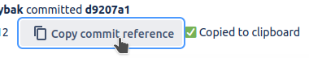
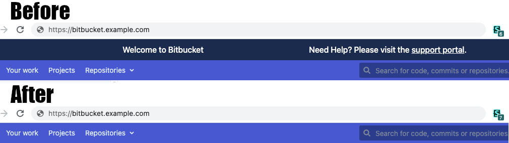
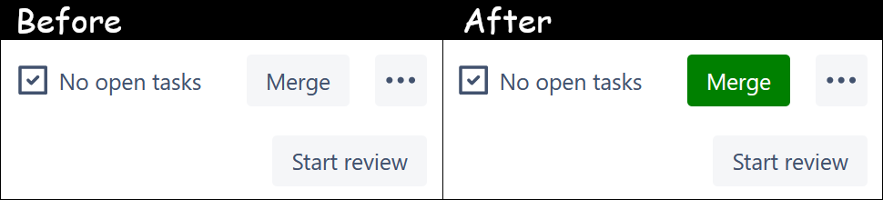
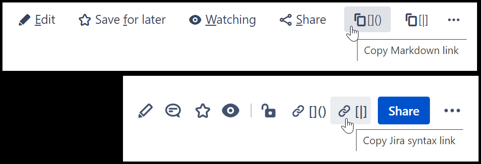
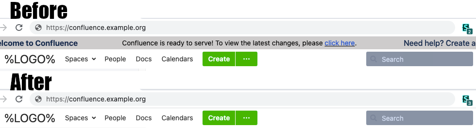

Atlassian Tweaks
================

This is a collection of [user scripts](https://en.wikipedia.org/wiki/Userscript)
and [user styles][WikipediaUserStyles] for [Bitbucket](#bitbucket),
[Confluence](#confluence), and [Jira](#jira).

The source code is distributed under the terms of [MIT](LICENSE.txt) or
[AGPL-3.0-only](LICENSE-AGPL-3.0-only.txt) licenses, depending on the file.
See individual scripts and styles for details.

Instructions on how to use user scripts and styles are at the bottom of the README.

The scripts were originally written for self-hosted variants of the Bitbucket,
Jira, and Confluence.  Half of the scripts and styles also support the newer
cloud variants – they are marked as such in their description.  Some scripts and
styles are no longer applicable to newer cloud variants due to significant UI
redesigns.

## <a id="bitbucket"></a>Bitbucket

[Bitbucket][Bitbucket] is a Git hosting provider.

### Bitbucket: copy commit reference
[![Greasy Fork link][badge_bitbucket_copy_commit_reference]][gfork_bitbucket_copy_commit_reference]

Adds "Copy commit reference" link to every commit page. Commit reference is a
commonly used [format][git-log-formats] to refer to past commits. It looks like
this:

> the example is [commit `1f0fc1d (pretty: implement 'reference' format, 2019-11-20)`](https://github.com/git/git/commit/1f0fc1db8599f87520494ca4f0e3c1b6fabdf997)
> in the git.git repository.

The copied reference supports plain text and rich text editors, with clickable
links to the commit, Jira issues, and Bitbucket pull requests.

This script supports both Bitbucket Server and Bitbucket Cloud.  See repository
[rybak/copy-commit-reference-userscript][CopyCommitReferenceGitHubRepo] for userscripts for other Git hostings.

[][gfork_bitbucket_copy_commit_reference]

### Bitbucket: hide banner
[![Greasy Fork link][badge_bitbucket_hide_banner_at_the_top]][gfork_bitbucket_hide_banner_at_the_top]
[![UserStyles.world link][badge_usw_bitbucket_hide_banner_at_the_top]][usw_bitbucket_hide_banner_at_the_top]

Hides the banner at the top of Bitbucket which takes up vertical space in cases
when it is almost never used.

[][gfork_bitbucket_hide_banner_at_the_top]

### Bitbucket: fix commit tooltip

The width of commit tooltip in Bitbucket can sometimes make it unreadable
because it is too narrow.  This user style increases the width of the tooltip
to accommodate commit messages wrapped at 72 characters.  It is the commonly
used standard for commit message wrapping, which is used by
[Git](https://github.com/git/git/blob/master/.editorconfig#L15-L16) itself. It
is also the default wrapping width in some text editors, such as
[Vim](https://github.com/vim/vim/blob/master/runtime/ftplugin/gitcommit.vim#L13)
and [IntelliJ IDEA](https://github.com/JetBrains/intellij-community/blob/5544872539d351efcff26220579ff3dccf17cb2a/platform/vcs-impl/src/com/intellij/vcs/commit/message/BodyLimitInspection.java#L29-L31).

https://github.com/rybak/atlassian-tweaks/raw/main/bitbucket-fix-commit-tooltip.user.css

[](https://github.com/rybak/atlassian-tweaks/raw/main/bitbucket-fix-commit-tooltip.user.css)

### Bitbucket: fix selection of breadcrumbs
[![Greasy Fork link][badge_bitbucket_fix_breadcrumbs_selection]][gfork_bitbucket_fix_breadcrumbs_selection]
[![UserStyles.world link][badge_usw_bitbucket_fix_breadcrumbs_selection]][usw_bitbucket_fix_breadcrumbs_selection]

Selection of file paths (breadcrumbs) is broken in some parts of the Bitbucket
UI in a way, that marker "UPDATED", "ADDED", or "DELETED" is selected, depending
on the exact way that the user performs the selection.  This style makes the
pill-shaped markers unselectable, fixing this issue.

This style supports both Bitbucket Server and Bitbucket Cloud.

### Bitbucket: commit links in diff tab of PRs
[![Greasy Fork link][badge_bitbucket_commit_links_in_diff_tab_of_prs]][gfork_bitbucket_commit_links_in_diff_tab_of_prs]

This user script brings back convenient links to individual commit pages to the
pull request's "Diff" tab, which was removed by Atlassian some time before
Bitbucket Server version 7.6.  The commit link includes a fancy tooltip, same as
commit links on the "Commits" tab.

[][gfork_bitbucket_commit_links_in_diff_tab_of_prs]

### Bitbucket: header color
[![Greasy Fork link][badge_bitbucket_header_color]][gfork_bitbucket_header_color]
[![UserStyles.world link][badge_usw_bitbucket_header_color]][usw_bitbucket_header_color]

Some instances of Bitbucket are deployed with custom look and feels, which have
unfortunate color of the header.  This user style allows changing the color of
Bitbucket header to any color.

This style supports both Bitbucket Server and Bitbucket Cloud.

[][gfork_bitbucket_header_color]

### Bitbucket: PR author avatar as favicon
[![Greasy Fork link][badge_bitbucket_pr_author_avatar_as_favicon]][gfork_bitbucket_pr_author_avatar_as_favicon]

This user script changes favicons of Bitbucket pull request pages (tab icon in
browsers) to the avatar of pull request's author, which makes it easier to
distinguish browser tabs.

This script supports both Bitbucket Server and Bitbucket Cloud.

[][gfork_bitbucket_pr_author_avatar_as_favicon]

### Bitbucket: readable commit messages
[![Greasy Fork link][badge_bitbucket_readable_commit_messages]][gfork_bitbucket_readable_commit_messages]
[![UserStyles.world link][badge_usw_bitbucket_readable_commit_messages]][usw_bitbucket_readable_commit_messages]

Commit pages on Bitbucket Cloud are not very readable.  This user style adds a
border around the commit messages, makes the font monospace, and makes the
subject line bold.  Many aspects of the style can be configured.
Demo: [monospace](https://i.imgur.com/a6nNxAI.png) and [without monospace](https://i.imgur.com/OMnBFQe.png).

This style supports only Bitbucket Cloud.

### Bitbucket: green merge button
[![Greasy Fork link][badge_bitbucket_green_merge_button]][gfork_bitbucket_green_merge_button]
[![UserStyles.world link][badge_usw_bitbucket_green_merge_button]][usw_bitbucket_green_merge_button]

This userstyle makes active merge buttons green in Bitbucket pull requests.
Inspired by [code review tool "Critique"](https://engineercodex.substack.com/p/how-google-takes-the-pain-out-of).
This style supports both Bitbucket Server and Bitbucket Cloud.

[][gfork_bitbucket_green_merge_button]

### Bitbucket: speed up CI builds
[![UserStyles.world link][badge_userstyles_world]][usw_bitbucket_fast_and_furious]

This user style speeds up continuous integration builds on Bitbucket.

[][usw_bitbucket_fast_and_furious]

## <a id="confluence"></a>Confluence

[Confluence][Confluence] is a corporate wiki.

### Confluence: space avatar as tab icon
[![Greasy Fork link][badge_confluence_space_avatar_as_tab_icon]][gfork_confluence_space_avatar_as_tab_icon]

Replaces tab icons for Confluence pages with avatars of the Confluence spaces.

This script supports both Confluence Server and Confluence Cloud.

### Confluence: copy link buttons
[![Greasy Fork link][badge_confluence_copy_link_buttons]][gfork_confluence_copy_link_buttons]

Adds buttons to copy a link to the current page directly into clipboard. Two
buttons are supported: Markdown and Jira syntax. Both buttons support HTML for
rich text editors.

This script supports both Confluence Server and Confluence Cloud.

[][gfork_confluence_copy_link_buttons]

### Confluence: hide banner
[![Greasy Fork link][badge_confluence_hide_banner_at_the_top]][gfork_confluence_hide_banner_at_the_top]
[![UserStyles.world link][badge_usw_confluence_hide_banner_at_the_top]][usw_confluence_hide_banner_at_the_top]

Hides the "precursor" banner at the top of Confluence which takes up vertical
space in cases when it is almost never used.

This style supports both Confluence Server and Confluence Cloud.

[][gfork_confluence_hide_banner_at_the_top]

### Confluence: better monospace
[![Greasy Fork link][badge_confluence_better_monospace]][gfork_confluence_better_monospace]
[![UserStyles.world link][badge_usw_confluence_better_monospace]][usw_confluence_better_monospace]

This style adds a border and a background to monospace text, making it easier
to distinguish from surrounding text.

This style supports both Confluence Server and Confluence Cloud.  On Confluence
Cloud, this style supports both light and dark themes.

[][gfork_confluence_better_monospace]

### Confluence: Simple Floating Table of Contents
[![Greasy Fork link][badge_confluence_simple_floating_toc]][gfork_confluence_simple_floating_toc]
[![UserStyles.world link][badge_usw_confluence_simple_floating_toc]][usw_confluence_simple_floating_toc]

This style moves the table of contents to the right side of the page and makes
the table of contents "sticky", floating in the same place when scrolling.

This style supports both Confluence Server and Confluence Cloud.

https://user-images.githubusercontent.com/624072/211896771-f93fd25a-a199-4bb0-9766-46dfe09438ce.mp4

## <a id="jira"></a>Jira

[Jira][Jira] is a bug-tracking, issue-tracking and project-management software
application.

### Jira: improve formatting of inline code
[![Greasy Fork link][badge_jira_better_inline_code_formatting]][gfork_jira_better_inline_code_formatting]
[![UserStyles.world link][badge_usw_jira_better_inline_code_formatting]][usw_jira_better_inline_code_formatting]

Code in Jira in `{{inline code}}` syntax can be hard to read sometimes.  This
user style adds a background and a border for such elements to improve
readability.

This style supports both Jira Server (self-hosted) and Jira Cloud. On Jira
Cloud, this style supports both light and dark themes.

[][gfork_jira_better_inline_code_formatting]

### Jira: copy summary button
[![Greasy Fork link][badge_jira_copy_summary]][gfork_jira_copy_summary]

This user script adds a "Copy summary" button for issue pages on Jira. The rich text (HTML) summary, which is great for pasting in Confluence and in Slack looks like this:

> [[MC-179867](https://bugs.mojang.com/browse/MC-179867)] <i>Unicode Characters swapped in Minecraft</i>

The plain text version looks like this:

```
[MC-179867] Unicode Characters swapped in Minecraft
```

[![Jira copy summary button][jira_copy_summary_button]][gfork_jira_copy_summary]

When on a Jira page, the script can be configured using the corresponding
extension menu item (screenshot from Tampermonkey):

[![Jira copy summary Tampermonkey configuration][copy-summary-cfg]][gfork_jira_copy_summary]

### Jira: copy code blocks
This user scripts adds a "Copy!" button to all code and preformatted blocks in
Jira to allow copying its contents.  Useful for copying commands when executing
Zephyr test cases.

https://github.com/rybak/atlassian-tweaks/raw/main/jira-copy-code-blocks.user.js

### Jira: better pull request links
[![Greasy Fork link][badge_jira_pull_request_link_improver]][gfork_jira_pull_request_link_improver]

Bitbucket integration in Jira is not very convenient.  It requires clicking on a
link, like "3 pull requests", before actually giving the user access to the
actual links to pull requests.  This user script adds a panel above
"Development" with a list of clickable links to pull requests.

[][gfork_jira_pull_request_link_improver]

### Jira: project avatar as favicon
[![Greasy Fork link][badge_jira_project_icon_as_tab_icon]][gfork_jira_project_icon_as_tab_icon]

This user script changes favicons of Jira pages (tab icon in browsers) to the
avatar of individual Jira projects, which makes it easier to distinguish browser
tabs of tickets in different projects.

This script supports both Jira Server (self-hosted) and Jira Cloud.

[][gfork_jira_project_icon_as_tab_icon]

## How to use Atlassian Tweaks

1. Install browser extensions for user scripts and user styles.
2. Install by clicking on buttons for [![Greasy Fork button][badge_greasy_fork]][greasy_fork_set] and
   [![UserStyles.world button][badge_userstyles_world]][userstyles_world],
   or the raw GitHub link in the sections above.
   The corresponding browser extension will automatically recognize the filename
   extension in the link and prompt you for its installation.

After installation, you can use the browser extension popup to disable or
enable individual scripts and styles if needed.  For some scripts, you will
need to refresh the page (in browser) to remove effects of the script.

### Custom domains

Both scripts and styles should automatically work on Bitbucket, Confluence, and
Jira domains which have `bitbucket`, `confluence`, or `jira` in their domain
name.  If a style or script doesn't work automatically, for example, if your
Bitbucket server lives on a domain without the word `bitbucket` in it, you will
have to add your domain manually.

Also, the automagical `@include` rules which scripts of Atlassian Tweaks use
might break in future versions of Chrome due to adoption of Manifest V3 for
browser extensions.  See documentation of [Firefox][firefox-patterns] and
[Google Chrome][chrome-patterns] for details.

#### Custom domains for user styles

For styles, if URL of your Bitbucket, Confluence, of Jira instance doesn't start
with `bitbucket`, `confluence`, or `jira` respectively, you'll have to manually
provide your domain.  Stylus instructions:

1. Click "Manage" button in the extension's menu
2. Click on cog icon in the row of the style that you need to adjust
3. In field "Your Bitbucket/Confluence/Jira domain", type in the domain of
   your Bitbucket, Confluence, or Jira server.  For example,
   `git.example.com` or `bugs.example.com`.  Up to two domains are supported.
   This menu should also be visible in the top right corner of the tab
   during installation of the style.

#### Custom domains for user scripts

Scripts use https://example.com by default. You might have to manually change
the URL in the "match" settings to the hostname of the Bitbucket, Jira, or
Confluence server that you use.

Tampermonkey instructions:

   1. Go to Dashboard in the extension menu
   2. Click "Edit" button in the line of the script that you've just installed
   3. Copy the value from `@match` field of the metadata
   4. Go to the tab "Settings"
   5. Click "Add..." under "User matches"
   6. Paste the copied value
   7. Replace the example domain with the domain of website you use
   8. Click "OK"

### Browser extensions

#### For scripts
- Big list of different extensions for different browsers available on
  https://greasyfork.org

User scripts are compatible with browser extensions Violentmonkey,
Tampermonkey, and Greasemonkey.

#### For styles
- Recommended – Stylus:
  - [Stylus for Chrome/Chromium](https://chrome.google.com/webstore/detail/stylus/clngdbkpkpeebahjckkjfobafhncgmne)
  - [Stylus for Firefox](https://addons.mozilla.org/en-US/firefox/addon/styl-us/)

[WikipediaUserStyles]: https://en.wikipedia.org/wiki/Stylus_(browser_extension)
[Confluence]: https://www.atlassian.com/software/confluence
[Bitbucket]: https://bitbucket.org/product
[Jira]: https://www.atlassian.com/software/jira
[copy-summary-cfg]: images/jira_copy_summary_cfg_tampermonkey.png
[jira_copy_summary_button]: images/jira_copy_summary_button.png
[chrome-patterns]: https://developer.chrome.com/docs/extensions/mv3/match_patterns/
[firefox-patterns]: https://developer.mozilla.org/en-US/docs/Mozilla/Add-ons/WebExtensions/Match_patterns
[git-log-formats]: https://git-scm.com/docs/git-log#_pretty_formats
[CopyCommitReferenceGitHubRepo]: https://github.com/rybak/copy-commit-reference-userscript

[badge_bitbucket_copy_commit_reference]: https://img.shields.io/badge/dynamic/json?style=flat&color=670000&label=Install%20version&query=version&url=https%3A%2F%2Fgreasyfork.org%2Fscripts%2F470667.json
[gfork_bitbucket_copy_commit_reference]: https://greasyfork.org/en/scripts/470667-bitbucket-copy-commit-reference "Install via Greasy Fork"
[badge_bitbucket_hide_banner_at_the_top]: https://img.shields.io/badge/dynamic/json?style=flat&color=670000&label=Install%20version&query=version&url=https%3A%2F%2Fgreasyfork.org%2Fscripts%2F463770.json
[gfork_bitbucket_hide_banner_at_the_top]: https://greasyfork.org/en/scripts/463770-bitbucket-hide-banner-at-the-top "Install via Greasy Fork"
[badge_usw_bitbucket_hide_banner_at_the_top]: https://img.shields.io/badge/dynamic/json?style=flat&color=193652&label=Install%20version&query=version&url=https%3A%2F%2Fgreasyfork.org%2Fscripts%2F463770.json
[usw_bitbucket_hide_banner_at_the_top]: https://userstyles.world/style/9296/bitbucket-hide-banner-at-the-top "Install via UserStyles.world"
[badge_bitbucket_fix_breadcrumbs_selection]: https://img.shields.io/badge/dynamic/json?style=flat&color=670000&label=Install%20version&query=version&url=https%3A%2F%2Fgreasyfork.org%2Fscripts%2F459782.json
[gfork_bitbucket_fix_breadcrumbs_selection]: https://greasyfork.org/en/scripts/459782-bitbucket-fix-breadcrumbs-selection "Install via Greasy Fork"
[badge_usw_bitbucket_fix_breadcrumbs_selection]: https://img.shields.io/badge/dynamic/json?style=flat&color=193652&label=Install%20version&query=version&url=https%3A%2F%2Fgreasyfork.org%2Fscripts%2F459782.json
[usw_bitbucket_fix_breadcrumbs_selection]: https://userstyles.world/style/9295/bitbucket-fix-breadcrumbs-selection "Install via UserStyles.world"
[badge_bitbucket_commit_links_in_diff_tab_of_prs]: https://img.shields.io/badge/dynamic/json?style=flat&color=670000&label=Install%20version&query=version&url=https%3A%2F%2Fgreasyfork.org%2Fscripts%2F456690.json
[gfork_bitbucket_commit_links_in_diff_tab_of_prs]: https://greasyfork.org/en/scripts/456690-bitbucket-commit-links-in-diff-tab-of-prs "Install via Greasy Fork"
[badge_bitbucket_header_color]: https://img.shields.io/badge/dynamic/json?style=flat&color=670000&label=Install%20version&query=version&url=https%3A%2F%2Fgreasyfork.org%2Fscripts%2F459783.json
[gfork_bitbucket_header_color]: https://greasyfork.org/en/scripts/459783-bitbucket-header-color "Install via Greasy Fork"
[badge_usw_bitbucket_header_color]: https://img.shields.io/badge/dynamic/json?style=flat&color=193652&label=Install%20version&query=version&url=https%3A%2F%2Fgreasyfork.org%2Fscripts%2F459783.json
[usw_bitbucket_header_color]: https://userstyles.world/style/9187/bitbucket-header-color "Install via UserStyles.world"
[badge_bitbucket_pr_author_avatar_as_favicon]: https://img.shields.io/badge/dynamic/json?style=flat&color=670000&label=Install%20version&query=version&url=https%3A%2F%2Fgreasyfork.org%2Fscripts%2F459150.json
[gfork_bitbucket_pr_author_avatar_as_favicon]: https://greasyfork.org/en/scripts/459150-bitbucket-pr-author-avatar-as-favicon "Install via Greasy Fork"
[badge_bitbucket_readable_commit_messages]: https://img.shields.io/badge/dynamic/json?style=flat&color=670000&label=Install%20version&query=version&url=https%3A%2F%2Fgreasyfork.org%2Fscripts%2F473890.json
[gfork_bitbucket_readable_commit_messages]: https://greasyfork.org/en/scripts/473890-bitbucket-readable-commit-messages "Install via Greasy Fork"
[badge_usw_bitbucket_readable_commit_messages]: https://img.shields.io/badge/dynamic/json?style=flat&color=193652&label=Install%20version&query=version&url=https%3A%2F%2Fgreasyfork.org%2Fscripts%2F473890.json
[usw_bitbucket_readable_commit_messages]: https://userstyles.world/style/11867/bitbucket-readable-commit-messages "Install via UserStyles.world"
[badge_bitbucket_green_merge_button]: https://img.shields.io/badge/dynamic/json?style=flat&color=670000&label=Install%20version&query=version&url=https%3A%2F%2Fgreasyfork.org%2Fscripts%2F481383.json
[gfork_bitbucket_green_merge_button]: https://greasyfork.org/en/scripts/481383-bitbucket-green-merge-button "Install via Greasy Fork"
[badge_usw_bitbucket_green_merge_button]: https://img.shields.io/badge/dynamic/json?style=flat&color=193652&label=Install%20version&query=version&url=https%3A%2F%2Fgreasyfork.org%2Fscripts%2F481383.json
[usw_bitbucket_green_merge_button]: https://userstyles.world/style/13446/bitbucket-green-merge-button "Install via UserStyles.world"
<!-- no separate badge for fast_and_furious, because the style is not published to Greasy Fork and
     UserStyles.world doesn't provide the version in its API: https://userstyles.world/api/style/9186 -->
[usw_bitbucket_fast_and_furious]: https://userstyles.world/style/9186/bitbucket-fast-and-furious "Install via UserStyles.world"

[badge_confluence_space_avatar_as_tab_icon]: https://img.shields.io/badge/dynamic/json?style=flat&color=670000&label=Install%20version&query=version&url=https%3A%2F%2Fgreasyfork.org%2Fscripts%2F462032.json
[gfork_confluence_space_avatar_as_tab_icon]: https://greasyfork.org/en/scripts/462032-confluence-space-avatar-as-tab-icon "Install via Greasy Fork"
[badge_confluence_better_monospace]: https://img.shields.io/badge/dynamic/json?style=flat&color=670000&label=Install%20version&query=version&url=https%3A%2F%2Fgreasyfork.org%2Fscripts%2F459792.json
[gfork_confluence_better_monospace]: https://greasyfork.org/en/scripts/459792-confluence-better-monospace "Install via Greasy Fork"
[badge_usw_confluence_better_monospace]: https://img.shields.io/badge/dynamic/json?style=flat&color=193652&label=Install%20version&query=version&url=https%3A%2F%2Fgreasyfork.org%2Fscripts%2F459792.json
[usw_confluence_better_monospace]: https://userstyles.world/style/9298/confluence-better-monospace "Install via UserStyles.world"
[badge_confluence_simple_floating_toc]: https://img.shields.io/badge/dynamic/json?style=flat&color=670000&label=Install%20version&query=version&url=https%3A%2F%2Fgreasyfork.org%2Fscripts%2F458053.json
[gfork_confluence_simple_floating_toc]: https://greasyfork.org/en/scripts/458053-confluence-simple-floating-toc "Install via Greasy Fork"
[badge_usw_confluence_simple_floating_toc]: https://img.shields.io/badge/dynamic/json?style=flat&color=193652&label=Install%20version&query=version&url=https%3A%2F%2Fgreasyfork.org%2Fscripts%2F458053.json
[usw_confluence_simple_floating_toc]: https://userstyles.world/style/9300/confluence-simple-floating-toc "Install via UserStyles.world"
[badge_confluence_copy_link_buttons]: https://img.shields.io/badge/dynamic/json?style=flat&color=670000&label=Install%20version&query=version&url=https%3A%2F%2Fgreasyfork.org%2Fscripts%2F470384.json
[gfork_confluence_copy_link_buttons]: https://greasyfork.org/en/scripts/470384-confluence-copy-link-buttons "Install via Greasy Fork"
[badge_confluence_hide_banner_at_the_top]: https://img.shields.io/badge/dynamic/json?style=flat&color=670000&label=Install%20version&query=version&url=https%3A%2F%2Fgreasyfork.org%2Fscripts%2F463771.json
[gfork_confluence_hide_banner_at_the_top]: https://greasyfork.org/en/scripts/463771-confluence-hide-banner-at-the-top "Install via Greasy Fork"
[badge_usw_confluence_hide_banner_at_the_top]: https://img.shields.io/badge/dynamic/json?style=flat&color=193652&label=Install%20version&query=version&url=https%3A%2F%2Fgreasyfork.org%2Fscripts%2F463771.json
[usw_confluence_hide_banner_at_the_top]: https://userstyles.world/style/9299/confluence-hide-banner-at-the-top "Install via UserStyles.world"

[badge_jira_better_inline_code_formatting]: https://img.shields.io/badge/dynamic/json?style=flat&color=670000&label=Install%20version&query=version&url=https%3A%2F%2Fgreasyfork.org%2Fscripts%2F459794.json
[gfork_jira_better_inline_code_formatting]: https://greasyfork.org/en/scripts/459794-jira-better-inline-code-formatting "Install via Greasy Fork"
[badge_usw_jira_better_inline_code_formatting]: https://img.shields.io/badge/dynamic/json?style=flat&color=193652&label=Install%20version&query=version&url=https%3A%2F%2Fgreasyfork.org%2Fscripts%2F459794.json
[usw_jira_better_inline_code_formatting]: https://userstyles.world/style/9301/jira-better-inline-code-formatting "Install via UserStyles.world"
[badge_jira_copy_summary]: https://img.shields.io/badge/dynamic/json?style=flat&color=670000&label=Install%20version&query=version&url=https%3A%2F%2Fgreasyfork.org%2Fscripts%2F475815.json
[gfork_jira_copy_summary]: https://greasyfork.org/en/scripts/475815-jira-copy-summary "Install via Greasy Fork"
[badge_jira_pull_request_link_improver]: https://img.shields.io/badge/dynamic/json?style=flat&color=670000&label=Install%20version&query=version&url=https%3A%2F%2Fgreasyfork.org%2Fscripts%2F456692.json
[gfork_jira_pull_request_link_improver]: https://greasyfork.org/en/scripts/456692-jira-pull-request-link-improver "Install via Greasy Fork"
[badge_jira_project_icon_as_tab_icon]: https://img.shields.io/badge/dynamic/json?style=flat&color=670000&label=Install%20version&query=version&url=https%3A%2F%2Fgreasyfork.org%2Fscripts%2F457217.json
[gfork_jira_project_icon_as_tab_icon]: https://greasyfork.org/en/scripts/457217-jira-project-icon-as-tab-icon "Install via Greasy Fork"

[badge_greasy_fork]: https://img.shields.io/badge/Greasy-Fork-670000
[greasy_fork_set]: https://greasyfork.org/en/scripts?language=all&set=585074
[badge_userstyles_world]: https://img.shields.io/badge/UserStyles-world-193652
[userstyles_world]: https://userstyles.world
