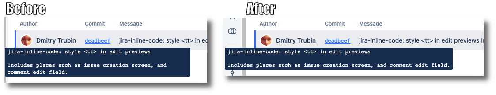

The width of commit tooltip in Bitbucket can sometimes make it unreadable
because it is too narrow.  This user style increases the width of the tooltip
to accommodate commit messages wrapped at 72 characters.  It is the commonly
used standard for commit message wrapping, which is used by
[Git](https://github.com/git/git/blob/master/.editorconfig#L15-L16) itself. It
is also the default wrapping width in some text editors, such as
[Vim](https://github.com/vim/vim/blob/master/runtime/ftplugin/gitcommit.vim#L13)
and [IntelliJ IDEA](https://github.com/JetBrains/intellij-community/blob/5544872539d351efcff26220579ff3dccf17cb2a/platform/vcs-impl/src/com/intellij/vcs/commit/message/BodyLimitInspection.java#L29-L31).

https://github.com/rybak/atlassian-tweaks/raw/main/bitbucket-fix-commit-tooltip.user.css

