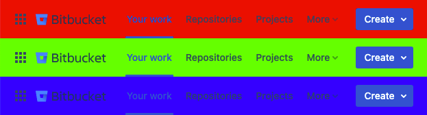

Some instances of Bitbucket are deployed with custom look and feels, which have
unfortunate color of the header.  This user style allows changing the color of
Bitbucket header to any color.

This style supports both Bitbucket Server and Bitbucket Cloud.

https://github.com/rybak/atlassian-tweaks/raw/main/bitbucket-header-color.user.css

