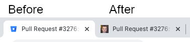

This user script changes favicons of Bitbucket pull request pages (tab icon in
browsers) to the avatar of pull request's author, which makes it easier to
distinguish browser tabs.

This script supports both Bitbucket Server and Bitbucket Cloud.

https://github.com/rybak/atlassian-tweaks/raw/main/bitbucket-pull-request-avatars.user.js

