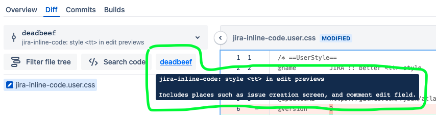

This user script brings back convenient links to individual commit pages to the
pull request's "Diff" tab, which was removed by Atlassian some time before
Bitbucket Server version 7.6.  The commit link includes a fancy tooltip, same as
commit links on the "Commits" tab.

https://github.com/rybak/atlassian-tweaks/raw/main/bitbucket-pull-request-commit-links.user.js

