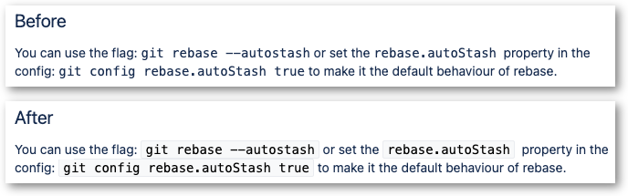

This style adds a border and a background to monospace text, making it easier
to distinguish from surrounding text.

This style supports both Confluence Server and Confluence Cloud.

https://github.com/rybak/atlassian-tweaks/raw/main/confluence-better-monospace.user.css

