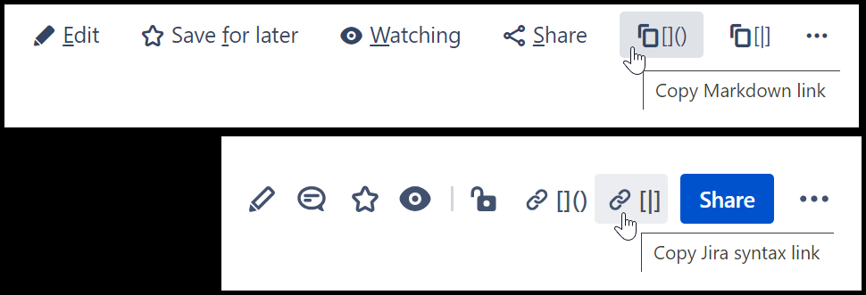

Adds buttons to copy a link to the current page directly into clipboard. Two
buttons are supported: Markdown and Jira syntax. Both buttons support HTML for
rich text editors.

This script supports both Confluence Server and Confluence Cloud.

https://github.com/rybak/atlassian-tweaks/raw/main/confluence-copy-link-buttons.user.js

