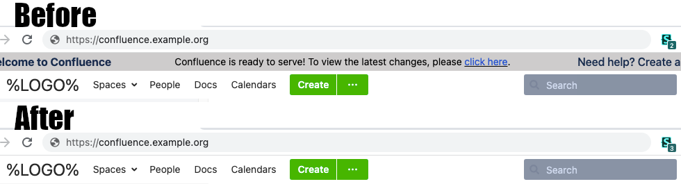

Hides the "precursor" banner at the top of Confluence which takes up vertical
space in cases when it is almost never used.

This style supports both Confluence Server and Confluence Cloud.

https://github.com/rybak/atlassian-tweaks/raw/main/confluence-hide-banner.user.css

