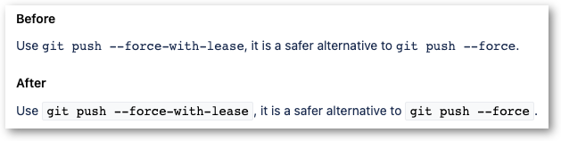

Code in Jira in `{{inline code}}` syntax can be hard to read sometimes.  This
user style adds a background and a border for such elements to improve
readability.

This style supports both Jira Server (self-hosted) and Jira Cloud.

https://github.com/rybak/atlassian-tweaks/raw/main/jira-inline-code.user.css
