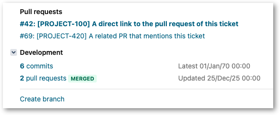

Bitbucket integration in Jira is not very convenient.  It requires clicking on a
link, like "3 pull requests", before actually giving the user access to the
actual links to pull requests.  This user script adds a panel above
"Development" with a list of clickable links to pull requests.

https://github.com/rybak/atlassian-tweaks/raw/main/jira-pr-links-improver.user.js

