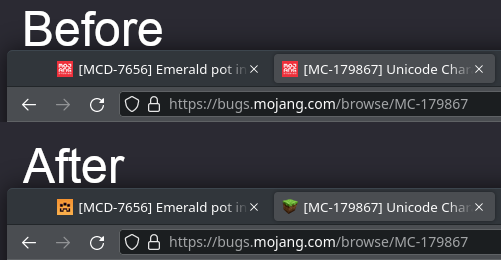

This user script changes favicons of Jira pages (tab icon in browsers) to the
avatar of individual Jira projects, which makes it easier to distinguish browser
tabs of tickets in different projects.

This script supports both Jira Server (self-hosted) and Jira Cloud.

https://github.com/rybak/atlassian-tweaks/raw/main/jira-project-avatar-as-favicon.user.js

